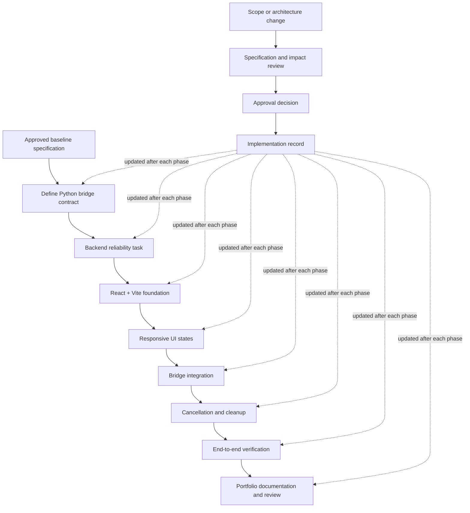

# React Migration Roadmap

```mermaid
flowchart TD
    A[Approved baseline specification] --> B[Define Python bridge contract]
    B --> C[Backend reliability task]
    C --> D[React + Vite foundation]
    D --> E[Responsive UI states]
    E --> F[Bridge integration]
    F --> G[Cancellation and cleanup]
    G --> H[End-to-end verification]
    H --> I[Portfolio documentation and review]

    R[Implementation record] -. updated after each phase .-> B
    R -. updated after each phase .-> C
    R -. updated after each phase .-> D
    R -. updated after each phase .-> E
    R -. updated after each phase .-> F
    R -. updated after each phase .-> G
    R -. updated after each phase .-> H
    R -. updated after each phase .-> I

    X[Scope or architecture change] --> Y[Specification and impact review]
    Y --> Z[Approval decision]
    Z --> R
```

Current milestone: Phase 0 complete. Next milestone: define and approve the local Python bridge contract.
